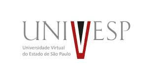

# Algoritmos e Programação de Computadores I

Esse é o repositório referente a disciplina Algoritmos e Programação de Computadores I do programa de facilitadores da UNIVESP do ano de 2020.

Nele Você encontrará os pequenos resumos de cada semana da disciplina junto com notebooks em python, onde terá exercícios resolvidos. O repositório será atualizado semanalmente

## Como abrir

- Abra as versões executaveis dos notebooks usando [Google Colab](http://colab.research.google.com): 

Se você tiver alguma dúvida em python sugiro entrar nesse reposítorio e clicar no [Aprendendo Python do zero][website], 

[website]: https://github.com/julhamarcolan/Aprendendo-Python-do-zero
